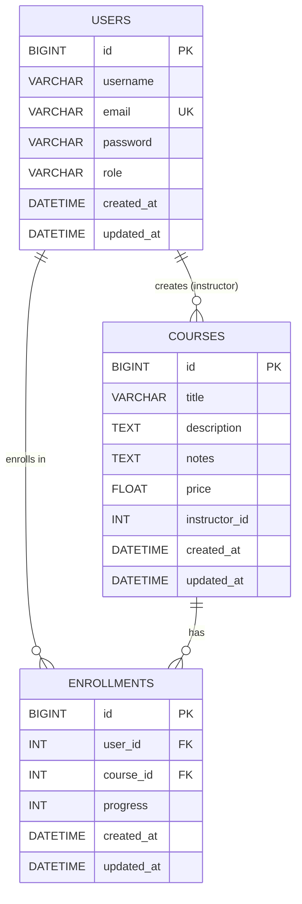

# Database Schema Document - Course Platform

## 1. Database Overview

### 1.1 Database System
- **Type**: MySQL (Relational Database Management System)
- **Engine**: InnoDB (Default, ACID-compliant)
- **Character Set**: utf8mb4
- **Collation**: utf8mb4_unicode_ci

### 1.2 Database Name
```
course_db
```

### 1.3 Connection Details
| Parameter | Value |
|-----------|-------|
| Host | localhost |
| Port | 3306 |
| User | root |
| Database | course_db |

---

## 2. Entity Relationship Diagram (ERD)

```
┌─────────────────────────┐
│         users            │
├─────────────────────────┤
│ PK  id (BIGINT)         │
│     username (VARCHAR)  │
│     email (VARCHAR) UK  │
│     password (VARCHAR)  │
│     role (VARCHAR)      │
│     created_at (DATETIME)│
│     updated_at (DATETIME)│
└────────────┬────────────┘
             │
             │ user_id
             │
┌────────────▼────────────┐     ┌─────────────────────────┐
│     enrollments          │     │        courses           │
├─────────────────────────┤     ├─────────────────────────┤
│ PK  id (BIGINT)         │     │ PK  id (BIGINT)         │
│ FK  user_id (INT)       │     │     title (VARCHAR)     │
│ FK  course_id (INT)     │     │     description (TEXT)  │
│     progress (INT)      │     │     notes (TEXT) NULL   │
│     created_at (DATETIME)│     │     price (FLOAT)       │
│     updated_at (DATETIME)│     │     instructor_id (INT) │
└─────────────────────────┘     │     created_at (DATETIME)│
                                │     updated_at (DATETIME)│
                                └─────────────────────────┘
```

---

## 3. Table Definitions

### 3.1 Users Table

#### 3.1.1 Schema
```sql
CREATE TABLE users (
    id BIGINT AUTO_INCREMENT PRIMARY KEY,
    username VARCHAR(100) NOT NULL,
    email VARCHAR(254) NOT NULL UNIQUE,
    password VARCHAR(255) NOT NULL,
    role VARCHAR(20) NOT NULL CHECK (role IN ('student', 'instructor')),
    created_at DATETIME DEFAULT CURRENT_TIMESTAMP,
    updated_at DATETIME DEFAULT CURRENT_TIMESTAMP ON UPDATE CURRENT_TIMESTAMP,
    INDEX idx_email (email),
    INDEX idx_role (role)
) ENGINE=InnoDB DEFAULT CHARSET=utf8mb4 COLLATE=utf8mb4_unicode_ci;
```

#### 3.1.2 Column Details
| Column | Type | Constraints | Description |
|--------|------|-------------|-------------|
| id | BIGINT | PRIMARY KEY, AUTO_INCREMENT | Unique user identifier |
| username | VARCHAR(100) | NOT NULL | User's display name |
| email | VARCHAR(254) | NOT NULL, UNIQUE | User's email address (login identifier) |
| password | VARCHAR(255) | NOT NULL | Hashed password |
| role | VARCHAR(20) | NOT NULL, CHECK | User role: 'student' or 'instructor' |
| created_at | DATETIME | DEFAULT CURRENT_TIMESTAMP | Record creation timestamp |
| updated_at | DATETIME | DEFAULT CURRENT_TIMESTAMP ON UPDATE | Last modification timestamp |

#### 3.1.3 Indexes
| Index Name | Columns | Type | Purpose |
|------------|---------|------|---------|
| PRIMARY | id | CLUSTERED | Primary key lookup |
| idx_email | email | UNIQUE | Email-based authentication lookup |
| idx_role | role | NON-UNIQUE | Role-based filtering |

#### 3.1.4 Sample Data
```sql
INSERT INTO users (username, email, password, role) VALUES
('john_doe', 'john@example.com', 'hashed_password_1', 'student'),
('jane_smith', 'jane@example.com', 'hashed_password_2', 'instructor'),
('bob_wilson', 'bob@example.com', 'hashed_password_3', 'student');
```

---

### 3.2 Courses Table

#### 3.2.1 Schema
```sql
CREATE TABLE courses (
    id BIGINT AUTO_INCREMENT PRIMARY KEY,
    title VARCHAR(200) NOT NULL,
    description TEXT NOT NULL,
    notes TEXT NULL,
    price FLOAT NOT NULL CHECK (price >= 0),
    instructor_id INT NOT NULL,
    created_at DATETIME DEFAULT CURRENT_TIMESTAMP,
    updated_at DATETIME DEFAULT CURRENT_TIMESTAMP ON UPDATE CURRENT_TIMESTAMP,
    INDEX idx_instructor (instructor_id),
    INDEX idx_title (title),
    INDEX idx_price (price)
) ENGINE=InnoDB DEFAULT CHARSET=utf8mb4 COLLATE=utf8mb4_unicode_ci;
```

#### 3.2.2 Column Details
| Column | Type | Constraints | Description |
|--------|------|-------------|-------------|
| id | BIGINT | PRIMARY KEY, AUTO_INCREMENT | Unique course identifier |
| title | VARCHAR(200) | NOT NULL | Course title |
| description | TEXT | NOT NULL | Detailed course description |
| notes | TEXT | NULL, OPTIONAL | Additional instructor notes |
| price | FLOAT | NOT NULL, CHECK >= 0 | Course price in USD |
| instructor_id | INT | NOT NULL | ID of the course instructor |
| created_at | DATETIME | DEFAULT CURRENT_TIMESTAMP | Record creation timestamp |
| updated_at | DATETIME | DEFAULT CURRENT_TIMESTAMP ON UPDATE | Last modification timestamp |

#### 3.2.3 Indexes
| Index Name | Columns | Type | Purpose |
|------------|---------|------|---------|
| PRIMARY | id | CLUSTERED | Primary key lookup |
| idx_instructor | instructor_id | NON-UNIQUE | Instructor's courses listing |
| idx_title | title | NON-UNIQUE | Title-based search |
| idx_price | price | NON-UNIQUE | Price range filtering |

#### 3.2.4 Sample Data
```sql
INSERT INTO courses (title, description, notes, price, instructor_id) VALUES
('Complete JavaScript Course', 'Learn JavaScript from scratch to advanced', 'Updated for ES2024', 49.99, 1),
('Python for Beginners', 'Master Python programming fundamentals', NULL, 39.99, 2),
('React Masterclass', 'Build modern web applications with React', 'Includes hooks deep dive', 59.99, 3);
```

---

### 3.3 Enrollments Table

#### 3.3.1 Schema
```sql
CREATE TABLE enrollments (
    id BIGINT AUTO_INCREMENT PRIMARY KEY,
    user_id INT NOT NULL,
    course_id INT NOT NULL,
    progress INT NOT NULL DEFAULT 0 CHECK (progress >= 0 AND progress <= 100),
    created_at DATETIME DEFAULT CURRENT_TIMESTAMP,
    updated_at DATETIME DEFAULT CURRENT_TIMESTAMP ON UPDATE CURRENT_TIMESTAMP,
    UNIQUE KEY unique_enrollment (user_id, course_id),
    INDEX idx_user (user_id),
    INDEX idx_course (course_id),
    INDEX idx_progress (progress)
) ENGINE=InnoDB DEFAULT CHARSET=utf8mb4 COLLATE=utf8mb4_unicode_ci;
```

#### 3.3.2 Column Details
| Column | Type | Constraints | Description |
|--------|------|-------------|-------------|
| id | BIGINT | PRIMARY KEY, AUTO_INCREMENT | Unique enrollment identifier |
| user_id | INT | NOT NULL | Reference to user (student) |
| course_id | INT | NOT NULL | Reference to enrolled course |
| progress | INT | NOT NULL, DEFAULT 0, CHECK 0-100 | Course completion percentage |
| created_at | DATETIME | DEFAULT CURRENT_TIMESTAMP | Enrollment date |
| updated_at | DATETIME | DEFAULT CURRENT_TIMESTAMP ON UPDATE | Last progress update |

#### 3.3.3 Indexes
| Index Name | Columns | Type | Purpose |
|------------|---------|------|---------|
| PRIMARY | id | CLUSTERED | Primary key lookup |
| unique_enrollment | (user_id, course_id) | UNIQUE | Prevent duplicate enrollments |
| idx_user | user_id | NON-UNIQUE | User's enrolled courses |
| idx_course | course_id | NON-UNIQUE | Course enrollment statistics |
| idx_progress | progress | NON-UNIQUE | Progress-based filtering |

#### 3.3.4 Sample Data
```sql
INSERT INTO enrollments (user_id, course_id, progress) VALUES
(1, 1, 75),
(1, 2, 30),
(3, 1, 100);
```

---

## 4. Relationships

### 4.1 Relationship Diagram
```
users (1) ──────< (N) enrollments (N) >────── (1) courses
```

### 4.2 Relationship Details

| Relationship | Type | Description |
|--------------|------|-------------|
| User → Enrollments | One-to-Many | A user can enroll in multiple courses |
| Course → Enrollments | One-to-Many | A course can have multiple enrolled users |
| User → Courses (via instructor_id) | One-to-Many | An instructor can create multiple courses |

### 4.3 Foreign Key Constraints (Recommended)

```sql
-- Add foreign key constraints for referential integrity
ALTER TABLE enrollments
    ADD CONSTRAINT fk_enrollment_user
    FOREIGN KEY (user_id) REFERENCES users(id)
    ON DELETE CASCADE
    ON UPDATE CASCADE;

ALTER TABLE enrollments
    ADD CONSTRAINT fk_enrollment_course
    FOREIGN KEY (course_id) REFERENCES courses(id)
    ON DELETE CASCADE
    ON UPDATE CASCADE;
```

---

## 5. Django Migrations

### 5.1 Initial Migration (0001_initial.py)

```python
# Generated by Django 5.2.12

from django.db import migrations, models


class Migration(migrations.Migration):

    initial = True

    dependencies = [
    ]

    operations = [
        migrations.CreateModel(
            name='User',
            fields=[
                ('id', models.BigAutoField(auto_created=True, primary_key=True, serialize=False, verbose_name='ID')),
                ('username', models.CharField(max_length=100)),
                ('email', models.EmailField(max_length=254, unique=True)),
                ('password', models.CharField(max_length=255)),
                ('role', models.CharField(choices=[('student', 'Student'), ('instructor', 'Instructor')], max_length=20)),
            ],
            options={
                'db_table': 'users',
            },
        ),
        migrations.CreateModel(
            name='Course',
            fields=[
                ('id', models.BigAutoField(auto_created=True, primary_key=True, serialize=False, verbose_name='ID')),
                ('title', models.CharField(max_length=200)),
                ('description', models.TextField()),
                ('price', models.FloatField()),
                ('instructor_id', models.IntegerField()),
            ],
            options={
                'db_table': 'courses',
            },
        ),
        migrations.CreateModel(
            name='Enrollment',
            fields=[
                ('id', models.BigAutoField(auto_created=True, primary_key=True, serialize=False, verbose_name='ID')),
                ('user_id', models.IntegerField()),
                ('course_id', models.IntegerField()),
                ('progress', models.IntegerField(default=0)),
            ],
            options={
                'db_table': 'enrollments',
            },
        ),
    ]
```

### 5.2 Notes Migration (0002_course_notes.py)

```python
# Generated by Django 5.2.12

from django.db import migrations, models


class Migration(migrations.Migration):

    dependencies = [
        ('courses', '0001_initial'),
    ]

    operations = [
        migrations.AddField(
            model_name='course',
            name='notes',
            field=models.TextField(blank=True, null=True),
        ),
    ]
```

---

## 6. SQL Queries for Common Operations

### 6.1 User Operations

```sql
-- Register a new user
INSERT INTO users (username, email, password, role) 
VALUES ('new_user', 'new@example.com', 'hashed_password', 'student');

-- Login query
SELECT id, role FROM users 
WHERE email = 'user@example.com' AND password = 'hashed_password';

-- Get all instructors
SELECT id, username, email FROM users 
WHERE role = 'instructor';

-- Get all students
SELECT id, username, email FROM users 
WHERE role = 'student';
```

### 6.2 Course Operations

```sql
-- Get all courses
SELECT * FROM courses ORDER BY id;

-- Get courses by instructor
SELECT * FROM courses 
WHERE instructor_id = 1 ORDER BY created_at DESC;

-- Get course count
SELECT COUNT(*) as total_courses FROM courses;
```

### 6.3 Enrollment Operations

```sql
-- Enroll a user in a course
INSERT INTO enrollments (user_id, course_id, progress) 
VALUES (1, 2, 0);

-- Get user's enrolled courses
SELECT c.*, e.progress, e.created_at as enrollment_date
FROM enrollments e
JOIN courses c ON e.course_id = c.id
WHERE e.user_id = 1;

-- Update progress
UPDATE enrollments 
SET progress = 50 
WHERE user_id = 1 AND course_id = 1;

-- Get progress for a specific course
SELECT progress 
FROM enrollments 
WHERE user_id = 1 AND course_id = 1;

-- Get course enrollment count
SELECT course_id, COUNT(*) as enrolled_students 
FROM enrollments 
GROUP BY course_id;

-- Get students enrolled in a specific course
SELECT u.id, u.username, u.email, e.progress
FROM enrollments e
JOIN users u ON e.user_id = u.id
WHERE e.course_id = 1;
```

---

## 7. Database Statistics Queries

### 7.1 Platform Analytics

```sql
-- Total users by role
SELECT role, COUNT(*) as count 
FROM users 
GROUP BY role;

-- Most popular courses (by enrollment)
SELECT c.title, COUNT(e.id) as enrollments
FROM courses c
LEFT JOIN enrollments e ON c.id = e.course_id
GROUP BY c.id, c.title
ORDER BY enrollments DESC
LIMIT 10;

-- Average course progress per user
SELECT u.username, AVG(e.progress) as avg_progress
FROM users u
JOIN enrollments e ON u.id = e.user_id
GROUP BY u.id, u.username;

-- Revenue by course
SELECT c.title, c.price, COUNT(e.id) as enrollments, 
       (c.price * COUNT(e.id)) as total_revenue
FROM courses c
LEFT JOIN enrollments e ON c.id = e.course_id
GROUP BY c.id, c.title, c.price
ORDER BY total_revenue DESC;

-- Course completion rate
SELECT c.title, 
       COUNT(CASE WHEN e.progress = 100 THEN 1 END) as completed,
       COUNT(e.id) as total_enrolled,
       ROUND((COUNT(CASE WHEN e.progress = 100 THEN 1 END) * 100.0 / COUNT(e.id)), 2) as completion_rate
FROM courses c
LEFT JOIN enrollments e ON c.id = e.course_id
GROUP BY c.id, c.title;
```

---

## 8. Database Optimization

### 8.1 Index Recommendations

```sql
-- Composite index for enrollment lookups
CREATE INDEX idx_enrollment_user_course ON enrollments(user_id, course_id);

-- Index for course search by title and price
CREATE INDEX idx_course_title_price ON courses(title, price);

-- Index for user role filtering
CREATE INDEX idx_user_role ON users(role);
```

### 8.2 Query Optimization Tips

1. **Use EXPLAIN** to analyze query execution plans
2. **Avoid SELECT *** - specify only needed columns
3. **Use LIMIT** for pagination
4. **Use prepared statements** to prevent SQL injection
5. **Batch operations** for bulk inserts/updates

### 8.3 Pagination Query Example

```sql
-- Get paginated courses
SELECT id, title, description, price, instructor_id 
FROM courses 
ORDER BY id 
LIMIT 10 OFFSET 0;  -- Page 1, 10 items per page

-- Get total count for pagination
SELECT COUNT(*) as total FROM courses;
```

---

## 9. Backup and Recovery

### 9.1 Backup Commands

```bash
# Full database backup
mysqldump -u root -p course_db > course_db_backup.sql

# Backup specific tables
mysqldump -u root -p course_db users courses enrollments > tables_backup.sql

# Backup with structure only
mysqldump -u root -p --no-data course_db > structure_backup.sql
```

### 9.2 Restore Commands

```bash
# Restore from backup
mysql -u root -p course_db < course_db_backup.sql
```

---

## 10. Security Considerations

### 10.1 Current State
- Passwords stored in plain text (CRITICAL)
- No foreign key constraints
- No input validation at database level

### 10.2 Recommended Improvements

```sql
-- Add password hashing (application level)
-- Use Django's make_password() and check_password()

-- Add foreign key constraints
ALTER TABLE enrollments
    ADD CONSTRAINT fk_enrollment_user
    FOREIGN KEY (user_id) REFERENCES users(id)
    ON DELETE CASCADE;

ALTER TABLE enrollments
    ADD CONSTRAINT fk_enrollment_course
    FOREIGN KEY (course_id) REFERENCES courses(id)
    ON DELETE CASCADE;

-- Add check constraints
ALTER TABLE courses
    ADD CONSTRAINT chk_price_positive CHECK (price >= 0);

ALTER TABLE enrollments
    ADD CONSTRAINT chk_progress_range CHECK (progress >= 0 AND progress <= 100);
```

### 10.3 User Permissions

```sql
-- Create application user with limited privileges
CREATE USER 'course_app'@'localhost' IDENTIFIED BY 'secure_password';

-- Grant necessary permissions
GRANT SELECT, INSERT, UPDATE, DELETE ON course_db.* TO 'course_app'@'localhost';

-- Revoke dangerous permissions
REVOKE DROP, ALTER, CREATE ON course_db.* FROM 'course_app'@'localhost';

FLUSH PRIVILEGES;
```

---

## 11. Database Schema Diagram (Mermaid)


